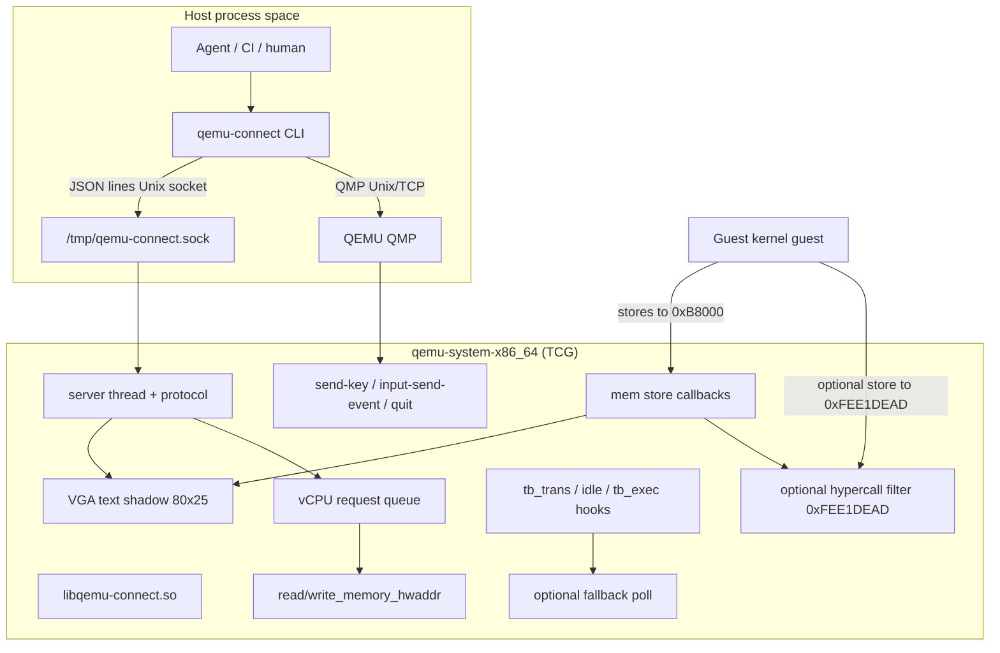
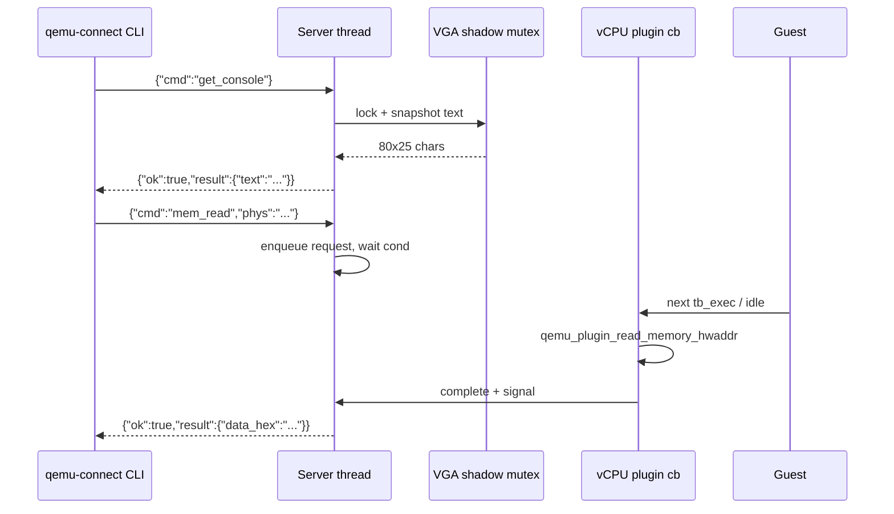
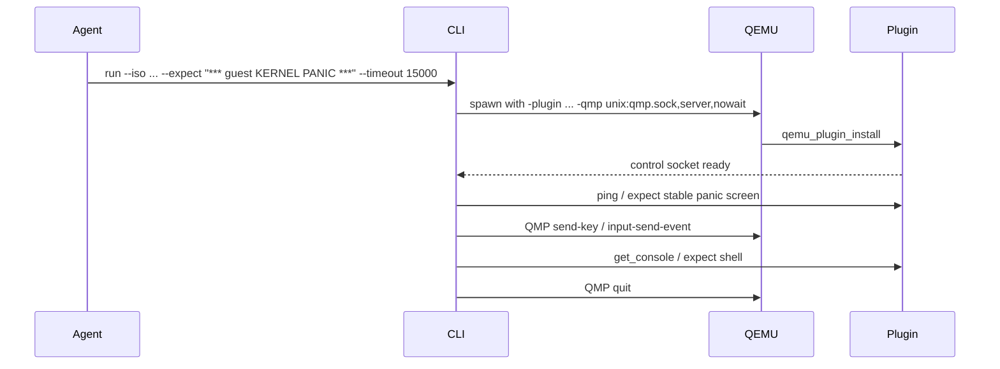
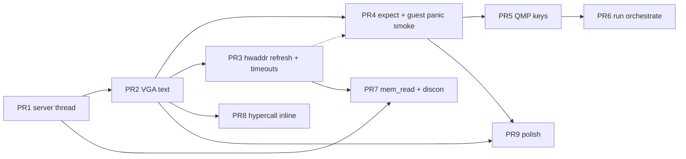

# qemu-connect: Agent Control Plane for QEMU Guests

| Field | Value |
|-------|--------|
| **Document** | Design + Implementation Plan |
| **Author** | TBD |
| **Date** | 2026-07-17 |
| **Status** | Draft (revised after design review) |
| **Repo** | [ft-mugurel/qemu-mip](https://github.com/ft-mugurel/qemu-mip) (`qemu-connect`) |
| **License** | GPL-2.0-or-later |
| **Local path** | `/home/mtu/MTU/xAI/trace/qemu-connect` |
| **Current baseline** | v0.1 scaffold (`09a9399` / `7cf1172`) |

---

## Overview

**qemu-connect** is an out-of-tree **QEMU TCG plugin** (`libqemu-connect.so`) plus a small **host CLI** (`qemu-connect`) that let coding agents boot freestanding kernels under QEMU and **observe and drive** them without a human watching VGA or typing at PS/2.

The problem is concrete: agents can already compile hobby kernels (e.g. **guest**, formerly guest), but QEMU’s interactive surface (VGA text + keyboard) is invisible to them. Serial-only workflows fail for VGA-centric kernels that never implement a UART.

The chosen approach (locked):

1. Official **TCG plugins** (`-plugin file=libqemu-connect.so,...`) — **not** a QEMU fork or in-tree device as the primary path.
2. Host **Unix domain socket**, **JSON-lines** control protocol.
3. **VGA text buffer scrape** at physical `0xB8000` so VGA-only kernels work without guest changes.
4. **QMP** for key injection and clean quit (plugins are not a keyboard device).
5. Optional guest **hypercall** later (magic phys `0xFEE1DEAD`).

This document is both architecture and a **phased, PR-sized implementation plan**, grounded in the existing scaffold under `plugin/`, `cli/`, and `include/`.

---

## Background & Motivation

### Current state (v0.1 scaffold)

| Component | Path | What it does today |
|-----------|------|--------------------|
| Plugin entry | `plugin/agent.c` | `qemu_plugin_install`, parses `socket=`, starts server, registers **TB translate** + atexit |
| VGA shadow | `plugin/vga.c`, `plugin/vga.h` | `qc_vga_note_store` / `qc_vga_snapshot_text` — **helpers only, not instrumented** |
| Socket server | `plugin/server.c` | Nonblocking Unix listen, **one client**, `qc_server_poll` |
| Protocol | `plugin/protocol.c` | `ping`, `version`, `get_console` **metadata stub** (no text payload) |
| CLI | `cli/main.c` | `ping` / `version` / `get_console` / `raw` |
| Shared constants | `include/qemu-connect.h` | Proto `0.1`, default sock, VGA dims, hypercall phys |
| Docs | `docs/architecture.md`, `docs/protocol.md` | High-level goals and wire sketch |
| Build | `Makefile` | `build/libqemu-connect.so`, `build/qemu-connect`, `make test-load` |

Local environment (verified):

- QEMU **11.0.1**, `QEMU_PLUGIN_VERSION` **6** at `/usr/include/qemu-plugin.h`
- Modern APIs available: `qemu_plugin_read/write_memory_{vaddr,hwaddr}`, registers, `qemu_plugin_set_pc`, discontinuity callbacks, time control

### Test guest: guest (`test/guest`, gitignored)

- Remote: `<your-kernel-repo-url>`
- x86_64 Multiboot2 GRUB ISO: `make iso` → `build/kernel.iso`
- Typical QEMU: `qemu-system-x86_64 -cdrom build/kernel.iso -boot order=d -m 512M`
- **Must use TCG** (no KVM) when plugin is loaded
- Early bring-up path (`src/kernel.rs` + `src/vga_print.rs`) writes **directly** to `0xB8000` (`*mut u16`). Boot sequence:
  1. Transient banners: `guest x86_64`, `long mode OK`, `multiboot2: OK`, `GDT+TSS: OK`, IDT gate count
  2. Deliberate `ud2` (vector 6)
  3. `exception_handler` (`src/interrupts/exceptions.rs`) calls **`clear_screen()`**, then paints the **stable end-state**:
     - `*** guest KERNEL PANIC ***`
     - `CPU exception`
     - `Invalid opcode (#UD)`
     - `vector=6` (and register dump)
     - `System halted.`
  4. Permanent `cli; hlt` (no further TB progress)
- **Agent smoke must assert the stable panic screen**, not the ephemeral pre-`ud2` banners. Banner dwell is sub-millisecond relative to 50–100 ms CLI poll intervals — CI that gates on `guest x86_64` / `long mode OK` will flake or fail after halt.
- Note: deliberate `ud2` produces **`*** guest KERNEL PANIC ***`** (exception path). The Rust `panic_handler` string `*** guest RUST PANIC ***` is a **different** path and is **not** the default smoke target.
- Historical `SMOKE.md` targets full shell (`kfs>`, `help`, `ls`, …); **x86_64 port is partial** — full shell is **not** the current agent target until guest catches up

### Pain points that agents hit today

1. No machine-readable console for VGA-only boots.
2. Plugin socket is only polled from `vcpu_tb_trans` — unreliable when the guest is idle (`hlt`), halted after panic, or under `-machine none` with sparse translation.
3. `get_console` does not return text, so agents cannot assert boot success.
4. No key injection path, so agents cannot drive interactive shells when they appear.
5. No orchestration helper: agents must manually wire plugin socket + QMP + ISO paths.

---

## Goals & Non-Goals

### Goals

1. **Agent-useful console**: after boot, `get_console` returns the full 80×25 character plane (and eventually wait/`expect` helpers).
2. **Shareable artifact**: ship `.so` + CLI; users do **not** rebuild QEMU.
3. **Zero guest changes first**: VGA path works for guest-as-is; hypercall is optional later.
4. **Continuous guest testing**: Makefile targets boot guest ISO under the plugin and assert the **stable post-`ud2` panic screen** (primary), with optional best-effort transient banner checks only if guest adds a hold flag later.
5. **Independently reviewable PRs**: each phase leaves `main` buildable and useful.
6. **Drive interaction**: CLI can inject keys via QMP and quit QEMU cleanly.
7. **Safe concurrency**: socket I/O never races VGA shadow or calls plugin memory APIs off vCPU context without a defined handoff.

### Non-Goals (for this plan)

- Not a general VNC/SPICE remote desktop.
- Not a QEMU fork or permanent in-tree device (device may be revisited only if plugins prove insufficient).
- Not multi-client session multiplexing in v1 (one control client is enough).
- Not full graphics framebuffer capture (text mode only initially).
- Not KVM acceleration while plugin is loaded (TCG required).
- Not a full MCP server in the first PRs (optional later, listed in roadmap).
- Not multi-architecture beyond x86_64 text VGA in the initial smoke path (plugin code should stay arch-agnostic where possible; tests focus on x86_64 guest).

---

## Proposed Design

### High-level architecture



### Component responsibilities

| Layer | Owner | Responsibility |
|-------|-------|----------------|
| Console text | Plugin (`vga.c` + mem callbacks) | Shadow of char plane at phys `0xB8000` |
| Control protocol | Plugin (`server.c` + `protocol.c`) | Accept clients, dispatch cmds, respond |
| Guest mem/reg inspect | Plugin (later) | Only from **vCPU context** or via deferred queue drained on hooks |
| Key injection / power | **QMP** via CLI | `send-key` / `input-send-event`, `quit` |
| Orchestration | CLI (`run` / scripts) | Spawn QEMU with plugin + QMP, wait for socket, run smoke steps |
| Guest structured events | Optional hypercall | Exit codes / `AGENT_READY` without serial |

### Critical design fix: server scheduling

**Problem.** Today `qc_server_poll()` runs only from `vcpu_tb_trans` in `plugin/agent.c`:

```c
static void vcpu_tb_trans(qemu_plugin_id_t id, struct qemu_plugin_tb *tb)
{
    if (g_server) {
        qc_server_poll(g_server);
    }
}
```

That fails when:

- Guest is in `hlt` / halted after panic (few new TBs).
- `-machine none` / early boot with little translation.
- CLI needs a response **while** the guest is idle.

**Decision: dedicated server thread (primary).**

1. At `qc_server_start`, spawn a **pthread** that blocks on `poll()`/`accept()` and reads **newline-framed** request lines (see **Socket framing** below).
2. Handlers that only need **host state** (ping, version, **shadow-only** `get_console`) run on the server thread under a mutex and **must never block on vCPU**.
3. Handlers that need **plugin/QEMU APIs** (`mem_read`, hwaddr snapshot refresh) enqueue work; a vCPU-side drain runs from:
   - `qemu_plugin_register_vcpu_tb_exec_cb` on translated blocks (cheap periodic drain), and/or
   - `qemu_plugin_register_vcpu_idle_cb` (when guest idles — fires when entering idle, **not** again for later requests while already halted), and/or
   - TB translate as a last-resort fallback.
4. **Every queued vCPU op has a timeout** (default **250 ms**, configurable later). On timeout return  
   `{"ok":false,"error":"vcpu_idle_timeout"}` — never wait forever. After guest’s permanent `cli; hlt`, **no** drain callback re-enters for new requests; timeouts are mandatory correctness, not optional polish.
5. Keep nonblocking `qc_server_poll` as a **fallback** for single-threaded debug builds if desired (`socket_thread=off` plugin arg).

**`get_console` default policy (normative):**

| Mode | When | Behavior |
|------|------|----------|
| **Shadow-only (default)** | Ordinary `{"cmd":"get_console"}` | Snapshot mutex-protected shadow; **no** queue; works after permanent halt |
| **Refresh** | Explicit `{"cmd":"get_console","refresh":true}` | Enqueue hwaddr read; wait ≤ timeout; on timeout hard error in v1 |
| **Cold shadow** | `write_count==0` without explicit refresh | Still shadow-only (spaces); client may retry with `refresh:true` (may time out if vCPU dead) |

Plugin arg `vga_refresh=on|off` means refresh is **allowed** when requested — **not** “always refresh.” Default remains shadow-only so post-panic agents stay responsive after PR1+PR2.

**Out of scope:** using QMP (NMI / `system_reset` / single-step) to poke a halted vCPU solely to drain the plugin queue.



**Thread-safety rules**

| Data | Writers | Readers | Sync |
|------|---------|---------|------|
| `qc_vga_state_t` | Mem callbacks (vCPU) | Server thread (`get_console`) | `pthread_mutex_t` (short critical sections) |
| Client fd / listen fd | Server thread only | Server thread | none (thread-owned) |
| Pending mem ops | Server thread | vCPU drain | mutex + condvar + **wait timeout** |
| `write_count` / `dirty` | Mem callbacks | Server | same VGA mutex |

**Never** call `qemu_plugin_read_memory_*` / register APIs from the pure server thread without going through the queue. The QEMU plugin header documents that several memory APIs are only valid in vCPU context.

### Socket framing (normative, PR1)

The v0.1 `qc_server_poll` does a single `read` and treats the buffer as one request. The threaded server **must** implement proper line framing:

| Rule | Value |
|------|--------|
| Delimiter | `\n` (optional preceding `\r` stripped) |
| Accumulation | Per-connection byte buffer; append `read()` data; peel complete lines |
| Max request line | **8192** bytes including newline |
| Overflow | Respond `{"ok":false,"error":"line_too_long"}` if possible, then **close** the client |
| Empty lines | Ignore |
| Pipelining (v1) | **Not supported**: one in-flight request per connection. Process strictly sequentially (read until one full line → handle → write response → repeat). Agents must not pipeline. |
| Partial lines | Leave in buffer across `poll` wakeups; do not parse incomplete JSON |

Response framing: one JSON object + `\n` per response (already partially done in `server.c`).

### VGA capture design

Constants already in `include/qemu-connect.h`:

- `QEMU_CONNECT_VGA_TEXT_PHYS = 0x000B8000`
- 80×25 cells × 2 bytes = 4000 bytes
- Shadow stores **character bytes only** (even offsets); attributes ignored in v1

#### Instrumentation strategy (phased)

**Phase A — Store callbacks (primary path for “live” shadow)**

In `vcpu_tb_trans`, for each instruction in the TB:

```c
// Pseudocode for agent.c / new mem.c
for (n = 0; n < qemu_plugin_tb_n_insns(tb); n++) {
    insn = qemu_plugin_tb_get_insn(tb, n);
    qemu_plugin_register_vcpu_mem_cb(insn, vga_mem_cb,
                                     QEMU_PLUGIN_CB_NO_REGS,
                                     QEMU_PLUGIN_MEM_W,
                                     &g_vga);
}
```

Callback (type-correct for QEMU 11 / API 6 — `qemu_plugin_mem_value` is a **struct**, not `uint64_t`):

```c
static uint64_t mem_value_as_u64(qemu_plugin_mem_value v)
{
    /* Host-endian payload per qemu-plugin.h; no extra byte-swap. */
    switch (v.type) {
    case QEMU_PLUGIN_MEM_VALUE_U8:  return v.data.u8;
    case QEMU_PLUGIN_MEM_VALUE_U16: return v.data.u16;
    case QEMU_PLUGIN_MEM_VALUE_U32: return v.data.u32;
    case QEMU_PLUGIN_MEM_VALUE_U64: return v.data.u64;
    case QEMU_PLUGIN_MEM_VALUE_U128:
        return v.data.u128.low; /* VGA cells are ≤ 8B; ignore high */
    default:
        return 0;
    }
}

static void vga_mem_cb(unsigned int vcpu_index, qemu_plugin_meminfo_t info,
                       uint64_t vaddr, void *userdata)
{
    qc_vga_state_t *vga = userdata;
    struct qemu_plugin_hwaddr *hw;
    uint64_t phys;
    qemu_plugin_mem_value val;
    unsigned size;
    uint64_t raw;

    if (!qemu_plugin_mem_is_store(info))
        return;
    hw = qemu_plugin_get_hwaddr(info, vaddr);
    if (!hw)
        return; /* rate-limited miss log */

    phys = qemu_plugin_hwaddr_phys_addr(hw);
    if (phys < QEMU_CONNECT_VGA_TEXT_PHYS ||
        phys >= QEMU_CONNECT_VGA_TEXT_PHYS + QEMU_CONNECT_VGA_BYTES)
        return;

    /*
     * Do NOT drop IO-backed hits. On PC + std VGA the text window is often
     * device memory; qemu_plugin_hwaddr_is_io(hw) may be true and still valid.
     */
    val = qemu_plugin_mem_get_value(info);
    size = 1u << qemu_plugin_mem_size_shift(info);
    raw = mem_value_as_u64(val);

    /* guest: volatile u16 stores of (attr<<8)|char — LE host puts char in low byte.
     * qc_vga_note_store already takes even offsets as character bytes. */
    qc_vga_lock(vga);
    qc_vga_note_store(vga, phys, raw, size);
    qc_vga_unlock(vga);
}
```

**LE u16 note:** guest `vga_print.rs` writes `cell = (color as u16) << 8 | b as u16`. On little-endian hosts, byte 0 of the value is the character and byte 1 is the attribute — matching `qc_vga_note_store`’s even-offset character extraction.

**Performance risk (Medium):** instrumenting **all** stores is costly on TCG. Mitigations, in order:

1. Early-out on physical range inside the callback (still pays callback entry cost).
2. Optional plugin arg `vga=on|off` (default on for system-x86).
3. Register only **stores** (`QEMU_PLUGIN_MEM_W`) — already planned; do not instrument loads.
4. Counters `mem_cb_fired` / `mem_cb_vga_hit` to decide if overhead is acceptable.
5. Later **`vga_mode=snapshot`** (Phase B only) if benchmarks demand dropping store callbacks.
6. ~~Coarse translate-time filter on “low 1 MiB”~~ — **not implementable reliably** with public plugin APIs (no portable static phys-range filter for arbitrary addressing modes). Treat as research only; **do not ship** a broken heuristic.

**Phase B — On-demand physical read (robustness; never the default path)**

Only when the client sends `{"cmd":"get_console","refresh":true}` (and `vga_refresh=on`), enqueue work for vCPU context:

```c
GByteArray *buf = g_byte_array_sized_new(QEMU_CONNECT_VGA_BYTES);
enum qemu_plugin_hwaddr_operation_result r =
    qemu_plugin_read_memory_hwaddr(QEMU_CONNECT_VGA_TEXT_PHYS, buf,
                                   QEMU_CONNECT_VGA_BYTES);
if (r == QEMU_PLUGIN_HWADDR_OPERATION_OK) {
    /* rebuild shadow from raw cells under VGA lock */
} else {
    /* complete queue waiter with error; see failure JSON below */
}
```

**Failure JSON (normative for refresh / mem_read):**

```json
{"ok":false,"error":"hwaddr_read_failed","result":{"code":"INVALID_ADDRESS"}}
{"ok":false,"error":"vcpu_idle_timeout"}
```

Map `qemu_plugin_hwaddr_operation_result` to a stable string in `result.code` (`ERROR`, `DEVICE_ERROR`, `ACCESS_DENIED`, `INVALID_ADDRESS`, `INVALID_ADDRESS_SPACE`).

Useful when:

- Store callbacks miss (device-backed VGA quirks) **and** the guest is still executing.
- Catch-up after attach mid-boot **before** permanent halt.
- `vga=off` recovery experiments.

**Not** a substitute for store callbacks under guest permanent halt — refresh will hit `vcpu_idle_timeout` there.

**Phase C hybrid (recommended product behavior):** keep store callbacks for `dirty`/`write_count` + low-latency updates; default `get_console` is shadow-only; optional explicit `refresh:true` with timeout.

#### VGA IO / device-memory policy (normative)

| Situation | Action |
|-----------|--------|
| `qemu_plugin_get_hwaddr` returns NULL | Skip update; increment miss counter; rate-limited `qemu_plugin_outs` once |
| `qemu_plugin_hwaddr_is_io(hw) == true` but phys in VGA range | **Still process** — do not drop IO hits |
| Store callbacks fire, `mem_cb_vga_hit > 0` | Happy path for guest smoke |
| Many mem callbacks, zero VGA hits after guest should have painted | One-shot diagnostic log — investigate phys vs vaddr |
| `read_memory_hwaddr(0xB8000)` fails | Return `hwaddr_read_failed`; leave shadow unchanged |

PR2 acceptance **requires** a measured guest (or tiny asm) run under `-display none -accel tcg` proving `write_count > 0` and non-space panic text via **shadow** (not refresh).

#### guest-specific notes

- Early path uses identity-mapped `0xB8000` volatile `u16` cells (`color<<8 | char`) — matches `qc_vga_note_store` LE character-at-even-offset logic.
- After deliberate `ud2`, `exception_handler` **clears** the screen and paints the panic frame; then permanent `cli; hlt`.
- **Server thread** must still answer shadow-only `get_console` so agents can read **`*** guest KERNEL PANIC ***`**, `Invalid opcode (#UD)`, and `System halted.` without any further TB activity or refresh.

### Protocol evolution

Current proto **0.1** (`QEMU_CONNECT_PROTO_MAJOR/MINOR` in `include/qemu-connect.h`).

Transport remains: **Unix stream, one JSON object per line, UTF-8**.

#### v0.2 — Real console (target of early PRs) — **normative schema**

Request:

```json
{"cmd":"get_console"}
{"cmd":"get_console","refresh":true}
```

Successful response (**required** fields):

| Field | Type | Required | Semantics |
|-------|------|----------|-----------|
| `cols` | number | yes | Always 80 in v0.2 |
| `rows` | number | yes | Always 25 in v0.2 |
| `writes` | number | yes | `qc_vga_state_t.write_count` (store hits processed) |
| `text_len` | number | yes | `strlen(text)` — **kept** for v0.1 clients / quick checks |
| `text` | string | yes | Full character plane, rows joined by `\n` (match `qc_vga_snapshot_text`) |
| `dirty` | bool | yes | Set `true` on any store into shadow; **cleared to `false` on successful snapshot** for this response |
| `source` | string | yes | `"shadow"` or `"refresh"` |

Example (guest **stable** panic screen, shadow path):

```json
→ {"cmd":"get_console"}
← {"ok":true,"result":{
     "cols":80,"rows":25,
     "writes":4000,
     "text_len":2074,
     "dirty":false,
     "source":"shadow",
     "text":"*** guest KERNEL PANIC ***\nCPU exception\n\nInvalid opcode (#UD)\n..."
   }}
```

JSON string escaping: implement `json_escape` for `\`, `"`, and control chars (v0.1 deferred this). Max text ~80×25 + newlines ≈ 2 KiB; response buffer in `server.c` is 8 KiB — **raise to 16–32 KiB** when adding text + future fields.

Additive-field policy: v0.1 had metadata only; adding `text` / `dirty` / `source` while **keeping** `text_len` is a **minor** bump to **0.2**.

#### v0.3 — Agent wait helpers

| cmd | Purpose |
|-----|---------|
| `expect` | Block until `text` matches regex/substring or timeout |
| `status` | Plugin uptime, client connected, write_count, last expect |

`expect` may be implemented **either** in the plugin (server thread scans shadow) **or** primarily in the CLI (poll `get_console`). **Recommendation:** implement wait logic in the **CLI first** (simpler, no long-lived plugin timers); add plugin-side `expect` only if latency/CPU of polling becomes an issue.

#### v0.4 — Memory / health

| cmd | Purpose | Context |
|-----|---------|---------|
| `mem_read` | `{phys|virt, len}` → hex | vCPU queue |
| `mem_write` | carefully gated | vCPU queue |
| `discon_stats` | exception/interrupt counts | discontinuity cb |

#### Wire stability policy

- Breaking response shape → bump **major**.
- Additive fields / new cmds → bump **minor**.
- CLI prints proto from `version` and should tolerate unknown result fields.

### QMP integration (CLI)

Plugins cannot inject PS/2 keys. The CLI owns QMP:



**CLI commands to add (incremental):**

| Command | Behavior |
|---------|----------|
| `ping` / `version` / `get_console` | Existing; enhance output |
| `expect <pattern> [--timeout MS]` | Poll console until match |
| `qmp-raw <json>` | Optional low-level |
| `type <string>` | Map chars → QMP key events |
| `key <name>...` | Named keys (`ret`, `esc`, …) |
| `run ...` | Orchestrate spawn + smoke (later PR) |

QEMU launch template for guest:

```sh
qemu-system-x86_64 \
  -display none \
  -m 512M \
  -cdrom test/guest/build/kernel.iso \
  -boot order=d \
  -accel tcg \
  -plugin ./build/libqemu-connect.so,socket=/tmp/qemu-connect.sock \
  -qmp unix:/tmp/qemu-connect-qmp.sock,server,nowait \
  -serial none
```

Notes:

- Explicit `-accel tcg` (or absence of `-enable-kvm`) is mandatory for plugins.
- `-display none` is correct for CI/agents; VGA **memory** still exists for text mode.
- Prefer unique socket paths per run (`/tmp/qemu-connect-$$.sock`) to avoid collisions.

### Optional guest hypercall (later)

Magic physical address `QEMU_CONNECT_HYPERCALL_PHYS` (`0xFEE1DEAD`):

- Guest stores a small struct or command word.
- Mem callback recognizes phys address → updates plugin-side status (`AGENT_READY`, `AGENT_EXIT`, exit code).
- Enables structured pass/fail without parsing VGA.
- **No guest change required for early PRs**; document the ABI when implemented.

Suggested minimal ABI (document in `docs/protocol.md` when implemented).

**v1 hypercall = fixed inline struct only** (what fits in stores to the magic page). **No guest pointers** in v1 — pointer+payload needs `mem_read` (PR7) and vCPU context; defer.

| Offset | Size | Field |
|--------|------|-------|
| 0 | 4 | magic `0x41474E54` (“AGNT”) |
| 4 | 4 | command (`READY=1`, `EXIT=2`, `LOG=3`) |
| 8 | 4 | status / exit code |
| 12 | 4 | reserved0 (must be 0 in v1) |

Guest writes this 16-byte block with ordinary stores. Plugin recognizes phys range `[0xFEE1DEAD, 0xFEE1DEAD+16)`. Large `LOG` payloads are **out of scope for v1**.

### Plugin arguments

| Arg | Default | Meaning |
|-----|---------|---------|
| `socket=PATH` | `/tmp/qemu-connect.sock` (dev default; prefer `$XDG_RUNTIME_DIR/qemu-connect.sock` on multi-user hosts) | Control socket (exists) |
| `socket_thread=on\|off` | `on` | Dedicated server thread |
| `vga=on\|off` | `on` | Install VGA store instrumentation |
| `vga_refresh=on\|off` | `on` | **Allow** explicit `get_console` refresh (does **not** auto-refresh) |
| `vcpu_queue_timeout_ms=N` | `250` | Timeout for deferred vCPU ops |
| `verbose=on\|off` | `off` | Extra `qemu_plugin_outs` |

Parse with existing loop in `parse_args` (`plugin/agent.c`); prefer `qemu_plugin_bool_parse` for booleans.

### Build & test surface

Extend root `Makefile`:

| Target | Purpose |
|--------|---------|
| `all` / `plugin` / `cli` | Existing |
| `test-load` | Existing: `-machine none` plugin load |
| `test-ping` | Spawn QEMU+plugin, CLI ping, quit |
| `test-guest-iso` | Build guest ISO if present |
| `test-guest-panic` | **Primary guest smoke**: boot ISO, shadow `get_console`/`expect` for stable panic strings |
| `test-guest-banner` | **Optional / best-effort only** — transient pre-`ud2` strings; **not** in default `smoke` |
| `smoke` | `test-ping` + `test-guest-panic` when `test/guest` exists |

Helper scripts under `scripts/` and `examples/`:

- `scripts/run-guest.sh` — launch QEMU with plugin + QMP
- `examples/guest-panic.sh` — agent-shaped primary smoke (stable panic screen)
- `examples/guest-banner.sh` — optional/experimental only (transient banners)
- Keep `examples/minimal-ping.sh`

**Missing guest skip policy (normative):** if `test/guest` is absent, `test-guest-iso` / `test-guest-panic` / `test-guest-banner` print `SKIP guest (clone into test/guest)` and **exit 0**. `smoke` still runs `test-ping` (must pass). Full agent validation requires guest clone + build deps. Do **not** use exit 77.

guest remains **gitignored** (`/test/*/`); document clone in `test/README.md` (already present).

### Directory layout (target after plan)

```text
.
├── plugin/
│   ├── agent.c          # install, hooks, arg parse
│   ├── vga.c / vga.h    # shadow + mutex wrappers
│   ├── mem.c / mem.h    # store callbacks, optional refresh (new)
│   ├── server.c / .h    # listen + thread
│   ├── protocol.c / .h  # JSON dispatch
│   ├── queue.c / .h     # deferred vCPU work (new, when mem_read lands)
│   └── hypercall.c      # later
├── cli/
│   ├── main.c           # command router
│   ├── qmp.c / qmp.h    # QMP client (new)
│   ├── expect.c         # console wait helpers (new, or inline)
│   └── run.c            # orchestration (later)
├── include/qemu-connect.h
├── docs/
├── scripts/
├── examples/
├── test/README.md
└── Makefile
```

---

## API / Interface Changes

### Plugin public surface

Unchanged entry:

```c
QEMU_PLUGIN_EXPORT int qemu_plugin_version = QEMU_PLUGIN_VERSION;
QEMU_PLUGIN_EXPORT int qemu_plugin_install(qemu_plugin_id_t id,
                                          const qemu_info_t *info,
                                          int argc, char **argv);
```

Internal APIs to evolve:

```c
/* server.h */
qc_server_t *qc_server_start(const char *socket_path, qc_vga_state_t *vga);
void qc_server_poll(qc_server_t *srv);   /* keep for fallback / tests */
void qc_server_stop(qc_server_t *srv);

/* vga.h — add locking helpers */
void qc_vga_lock(qc_vga_state_t *s);
void qc_vga_unlock(qc_vga_state_t *s);
void qc_vga_load_cells(qc_vga_state_t *s, const uint8_t *cells, size_t len);

/* mem instrumentation */
void qc_mem_register_tb(struct qemu_plugin_tb *tb, qc_vga_state_t *vga);
```

### CLI UX (before → after)

**Before (v0.1):**

```sh
./build/qemu-connect --socket /tmp/qemu-connect.sock ping
./build/qemu-connect get_console   # metadata only
```

**After (mid-plan):**

```sh
./build/qemu-connect --socket "$SOCK" get_console          # full text
./build/qemu-connect --socket "$SOCK" expect "*** guest KERNEL PANIC ***" --timeout 15000
./build/qemu-connect --socket "$SOCK" expect "Invalid opcode (#UD)" --timeout 1000
./build/qemu-connect --qmp "$QMP" quit
./build/qemu-connect run --iso test/guest/build/kernel.iso \
    --expect "*** guest KERNEL PANIC ***" --timeout 15000
```

### Protocol response for `get_console` (breaking-friendly)

v0.1 returns only metadata. Adding `text` is **backward compatible** (additive field) → bump minor to **0.2**, keep major 0.

---

## Data Model Changes

No persistent database. In-memory only:

```c
typedef struct {
    char text[80 * 25];
    uint64_t write_count;
    bool dirty;
    pthread_mutex_t lock;   /* NEW */
} qc_vga_state_t;

typedef struct {
    int listen_fd;
    int client_fd;          /* still single client in v1 */
    char path[108];
    qc_vga_state_t *vga;
    pthread_t thread;       /* NEW */
    bool thread_started;    /* NEW */
    volatile bool stop;     /* NEW */
} qc_server;
```

**Migration:** none. Socket path unlink on start remains as today (`server.c`).

**Storage estimates:** shadow ~2 KiB; response buffers ~16–32 KiB; negligible.

**Latency targets (agent UX):**

| Operation | Target |
|-----------|--------|
| `ping` RTT | < 5 ms on local Unix socket |
| `get_console` | < 20 ms from shadow; < 50 ms with hwaddr refresh |
| `expect` poll interval | 50–100 ms default |
| guest panic screen visible (shadow) | typically < 5–15 s cold boot under TCG + GRUB |
| Queued vCPU op timeout | default 250 ms → `vcpu_idle_timeout` |

---

## Alternatives Considered

### 1. Serial console + host `expect` only

| Pros | Cons |
|------|------|
| Simple, mature tooling | Requires UART driver in guest |
| No plugin / GPL plugin issues | guest kernel historically VGA-centric |
| Works with KVM | Agents still blind on VGA-only panic screens |

**Rejected as primary** — fails the “no guest changes / VGA hobby kernels” goal. Remains a **complement** if guests add serial later.

### 2. In-tree QEMU device / QEMU fork

| Pros | Cons |
|------|------|
| Clean MMIO device model | Users must rebuild/patch QEMU |
| Easy keyboard device | Not shareable as a drop-in `.so` |
| | High maintenance across QEMU versions |

**Rejected as primary.** Revisit only if plugin API cannot scrape VGA reliably on major distros.

### 3. Pure VNC/SPICE framebuffer OCR

| Pros | Cons |
|------|------|
| Works for graphical UIs | Heavy deps, flaky OCR |
| No guest phys knowledge | Overkill for 80×25 text |

**Rejected.**

### 4. Poll-only socket from TB translate (current scaffold)

| Pros | Cons |
|------|------|
| No threads | Breaks on idle/halt |
| Tiny code | Bad agent UX |

**Superseded** by server thread + optional hooks.

### 5. Snapshot-only VGA (no store callbacks)

| Pros | Cons |
|------|------|
| Lower TCG overhead | Needs vCPU context for each refresh |
| Simpler | May miss short-lived messages if not polled |

**Keep as Phase B complement**, not sole path initially — guest panic screens are stable, but interactive shells need freshness.

---

## Security & Privacy Considerations

| Threat | Severity | Mitigation |
|--------|----------|------------|
| World-writable Unix socket → local RCE-ish control of guest / QEMU | **High** | PR1: after bind, `chmod(path, 0600)` (and/or `fchmod` where applicable); restrictive `umask` before bind. `/tmp` is sticky world-writable — prefer `$XDG_RUNTIME_DIR/qemu-connect.sock` in docs/examples for multi-user hosts; `/tmp/...` remains dev default. Optional later: `socket_mode=` |
| Malicious plugin client reads guest memory (`mem_read`) | **Medium** | Document that control socket is **trusted-local**; do not expose over TCP without auth; gate `mem_write` behind explicit plugin arg `unsafe_write=on` |
| Path traversal / long `socket=` | **Low** | Cap path length to `sizeof(sockaddr_un.sun_path)`; reject empty |
| TOCTOU on unlink of socket path | **Low** | Standard Unix socket pattern; document multi-user risks |
| Guest escape via hypercall | **Low** | Hypercall only updates plugin state; never executes host commands from guest payload without explicit allowlist |
| Logging sensitive console data | **Low** | Default not to log full console to QEMU stderr; `verbose` only |

**Auth model (v1):** ambient authority of filesystem permissions on the Unix socket. No tokens. Acceptable for single-user agent/CI machines; call out multi-tenant hosts as unsupported without extra hardening.

**Privacy:** console text may contain secrets the guest prints; treat socket traffic as sensitive as a serial console.

---

## Observability

### Logging

- Use `qemu_plugin_outs()` for install/unload, bind failures, client connect/disconnect (rate-limited).
- CLI: stderr for errors, stdout for JSON results (keep machine-parseable).
- Avoid printf from hot mem callbacks except behind `verbose`.

### Metrics (lightweight counters in `status`)

| Metric | Source |
|--------|--------|
| `vga_writes` | `qc_vga_state_t.write_count` |
| `clients_accepted` | server |
| `requests_total` / `requests_error` | protocol |
| `mem_cb_fired` / `mem_cb_vga_hit` | mem instrumentation (ratio → overhead signal) |
| `queue_depth` / `queue_wait_ms` | deferred work |

### Alerting / CI signals

- Smoke tests are the primary “alert”: non-zero exit if **stable panic strings** missing within timeout.
- Hang detection later: discontinuity flood, or no VGA writes + no TB progress for N seconds → `status.stalled=true`.

---

## Rollout Plan

1. **Feature flags via plugin args** (`vga=`, `socket_thread=`) — always ship defaults that work for agents.
2. **Staged PRs** (see **PR Plan**): each PR mergeable alone; docs + Makefile updated per PR.
3. **Compat:** CLI must work against older plugin minors where possible (`text` field optional until both sides updated).
4. **Rollback:** unload plugin / boot without `-plugin`; no guest disk format changes.
5. **Version matrix:** primary support **QEMU 11 / plugin API 6**; document minimum for mem rw APIs as **API ≥ 5** (`read_memory_hwaddr` arrived in version 5). Soft-fail with clear `qemu_plugin_outs` if `info->version.cur < required`.

### Risks register

| Risk | Severity | Mitigation |
|------|----------|------------|
| Server only polled on TB translate | **High** (today) | PR1: dedicated server thread |
| Queued vCPU op waits forever after permanent `hlt` | **High** | Mandatory queue timeout; default `get_console` shadow-only; never auto-refresh |
| VGA is IO/device-backed; phys callbacks miss | **Medium** | Process IO hits in range; measured guest `write_count>0` gate in PR2; refresh only while vCPU live |
| Full-store instrumentation slows TCG badly | **Medium** | counters + `vga=off` + later `vga_mode=snapshot` (no fake 1 MiB translate filter) |
| Thread safety bugs (use-after-free on unload) | **High** | stop flag, shutdown fds, `pthread_join` before free; mem cbs must tolerate teardown |
| QMP key maps differ across QEMU versions | **Low** | integrate against local 11.0.1; abstract key table; PR5 automated quit gate |
| guest smoke gates on ephemeral banners | **High** (if wrong) | Assert stable `KERNEL PANIC` / `#UD` / `System halted.` |
| Plugin API version skew on distros | **Medium** | document; CI note; compile-time `QEMU_PLUGIN_VERSION` |
| Single client only | **Low** | document; reject extra accepts or replace client |
| Partial JSON reads / multi-line framing bugs | **Medium** | PR1 line buffer + max line + no pipelining |

---

## Open Questions

1. **JSON library vs hand parsers:** stay with lightweight string match (`has_cmd`) for small cmd set, or vendor a tiny parser (cJSON) when nesting grows? *Lean: hand-rolled until `expect`/`mem_read` force structure.*
2. **Plugin-side vs CLI-side `expect`:** recommendation is CLI-first; confirm if agents need multi-client plugin-side waits.
3. **Should `run` live in the C CLI or shell scripts?** Shell is faster to iterate; C is better for Windows-less Linux agents in one binary. *Propose: shell in PR for guest smoke; C `run` optional later.*
4. **Attribute capture:** store attribute bytes for color-aware tests? Not required for guest panic-string checks.
5. **Multi-vCPU:** guest is UP; mem callbacks must still be correct if `smp>1` (mutex already planned).
6. **Upstream packaging:** AUR/copr vs user-local `make install` prefix — defer.

---

## Key Decisions

| Decision | Choice | Rationale |
|----------|--------|-----------|
| Extension mechanism | **TCG plugin**, not fork/device | Shareable `.so`, official API, deep visibility |
| Console without guest changes | **Phys scrape `0xB8000`** | Matches guest kernel VGA path; works with `-display none` |
| Control transport | **Unix socket + JSON lines** | Simple for agents; easy to debug with `socat`/`raw` |
| Keyboard / power | **QMP from CLI** | Plugins are not input devices; QMP is stable |
| Socket responsiveness | **Dedicated server thread** | Works during `hlt`/panic; TB-only poll is insufficient |
| VGA update mechanism | **Store callbacks + optional hwaddr refresh** | Live + robust |
| Guest hypercall | **Optional, later** | Avoid blocking usefulness on kernel patches |
| Primary test guest | **guest under `test/guest`** | Real freestanding kernel; ISO path documented |
| Early smoke assertions | **Stable post-`ud2` panic screen** from `exception_handler`, not transient `kmain` banners and not full `SMOKE.md` shell | Only reliable VGA end-state under current guest |
| Default `get_console` | **Shadow-only**; refresh explicit + timed | Halt-safe for agents |
| Queued vCPU work | **Timeout (250 ms default)** → `vcpu_idle_timeout` | Idle callbacks do not re-fire after permanent halt |
| Socket framing | Newline, 8 KiB max, no pipelining in v1 | Avoid flaky partial reads |
| License | **GPL-2.0-or-later** | Required for `qemu-plugin.h` compatibility |
| Proto versioning | Major.minor in header + `version` cmd | Agents can negotiate |
| One control client | **v1 single client** | Enough for one agent session; simpler locking |

---

## References

- Local code: `/home/mtu/MTU/xAI/trace/qemu-connect`
- `docs/architecture.md`, `docs/protocol.md`, `README.md`
- QEMU plugin header: `/usr/include/qemu-plugin.h` (API version 6)
- QEMU binary: 11.0.1 (`qemu-system-x86_64`)
- guest: `test/guest` (`<your-kernel-repo-url>`)
- guest VGA: `test/guest/src/vga_print.rs`, entry `test/guest/src/kernel.rs`
- Remote: `git@github.com:ft-mugurel/qemu-mip.git`

---

## PR Plan

Ordered, independently reviewable PRs. Each lists files, dependencies, acceptance criteria, and guest/Makefile test notes.

### PR1 — Server thread + reliable `ping` under idle/halt

| | |
|--|--|
| **Title** | `plugin: dedicated control-socket thread so agents work while guest is idle` |
| **Depends on** | — (scaffold) |
| **Files** | `plugin/server.c`, `plugin/server.h`, `plugin/agent.c`, `docs/architecture.md`, `Makefile`, optionally `scripts/dev-load.sh` |

**Work**

1. **Build:** `CFLAGS += -pthread`, `LDFLAGS_PLUGIN += -pthread` (and CLI if it grows threads). Current Makefile only has `-shared` + glib — **must** add pthread linkage on Linux.
2. Spawn pthread in `qc_server_start`; loop on `poll(listen_fd, client_fd)`.
3. **Line framing** (see Socket framing): accumulate buffer; max 8192; sequential request/response; no pipelining.
4. Move request handling out of TB-only path; keep `qc_server_poll` as optional fallback when `socket_thread=off`.
5. **`plugin_exit` / atexit order (normative):** set `stop` → `shutdown`/`close` listen + client fds to unblock `poll` → `pthread_join` server thread → free server; only then tear down VGA. Mem callbacks that outlive the server must no-op if pointers cleared under lock.
6. After bind: `chmod(socket_path, 0600)`.
7. Plugin arg `socket_thread=on|off` (default on).
8. `test-ping`: QEMU `-machine none -display none -accel tcg -plugin ...` (**zero guest code**), CLI connect/disconnect loop + `ping`, then teardown.

**Acceptance**

- [ ] Plugin links with `-pthread`; `make` succeeds on a clean tree.
- [ ] `make test-ping` passes with **no guest** (`-machine none`).
- [ ] `ping`/`version` work without TB translate activity.
- [ ] Connect/disconnect/exit loop does not crash or hang (unload: join-before-free).
- [ ] Partial-line then remainder in a second write still parses one request.
- [ ] Oversized line closes client safely.
- [ ] Socket mode is `0600` after bind (when FS allows).
- [ ] Docs note thread model + framing + chmod.

**guest:** not required for PR1.

---

### PR2 — VGA store instrumentation + real `get_console` text

| | |
|--|--|
| **Title** | `plugin: scrape VGA text at 0xB8000 and return console text` |
| **Depends on** | PR1 (mutex-friendly server thread) |
| **Files** | `plugin/agent.c`, `plugin/vga.c`, `plugin/vga.h`, new `plugin/mem.c`/`mem.h`, `plugin/protocol.c`, `include/qemu-connect.h` (proto minor → 0.2), `docs/protocol.md`, `cli/main.c` (pretty-print optional), `Makefile` |

**Work**

1. On TB translate, register `qemu_plugin_register_vcpu_mem_cb(..., QEMU_PLUGIN_MEM_W)` for each insn.
2. Callback: unpack `qemu_plugin_mem_value` via `type`/`data` (see Phase A pseudocode); phys filter; **do not skip `is_io`**; `qc_vga_note_store` under mutex.
3. Default `get_console` = **shadow-only** normative v0.2 schema (`text`, `text_len`, `dirty` clear-on-snapshot, `source:"shadow"`).
4. JSON string escaping for console payload.
5. Grow response buffer to 16–32 KiB.
6. Counters: `mem_cb_fired`, `mem_cb_vga_hit`; rate-limited miss log if hits stay zero.
7. `vga=on|off` plugin arg.

**Acceptance**

- [ ] Synthetic `qc_vga_note_store` LE u16 cell → correct character in snapshot (optional tiny host test).
- [ ] **Measured guest path** (preferred): under `-display none -accel tcg`, after boot settles, shadow `get_console` has `writes > 0` and `text` contains `*** guest KERNEL PANIC ***` (or a tiny asm guest that paints known cells if guest unavailable).
- [ ] IO-backed VGA stores still update shadow (no `is_io` early-return drop).
- [ ] Proto minor 0.2 documented with normative field table.
- [ ] `vga=off` disables store instrumentation; shadow stays blank/spaces.

**guest / skip**

- Full automated `test-guest-panic` lands in **PR4**, but PR2 manual/scripted checks must use **panic** strings, not banners.
- If `test/guest` missing: print `SKIP guest` and **exit 0** for guest-only helpers.

---

### PR3 — Physical refresh path + queue timeouts (not required for guest smoke)

| | |
|--|--|
| **Title** | `plugin: optional hwaddr refresh for get_console with vCPU queue timeouts` |
| **Depends on** | PR2 |
| **Required for guest default smoke?** | **No** — panic screen is captured by store shadow in PR2; PR4 may merge without PR3 |
| **Files** | `plugin/mem.c`, `plugin/protocol.c`, `plugin/agent.c`, new minimal `plugin/queue.c`/`queue.h`, `docs/protocol.md` |

**Work**

1. Support explicit `{"cmd":"get_console","refresh":true}` only when `vga_refresh=on` (allow, not always).
2. Minimal deferred queue: server thread enqueues; `tb_exec` / `idle` / `tb_trans` drain; **wait with timeout** (`vcpu_queue_timeout_ms`, default 250).
3. Rebuild shadow from 4000 raw bytes via `qc_vga_load_cells` on OK read; set `source:"refresh"`.
4. On timeout: `{"ok":false,"error":"vcpu_idle_timeout"}` — **do not hang**. Permanent guest `hlt` takes this path for refresh.
5. On hwaddr failure: `hwaddr_read_failed` + `result.code` mapping.
6. **Do not** auto-refresh when `write_count==0` without an explicit client request.

**Acceptance**

- [ ] **(a)** After guest panic/halt, **shadow-only** `get_console` still returns panic text (regression; no refresh).
- [ ] **(b)** `refresh:true` after permanent halt returns `vcpu_idle_timeout` within ~timeout (not hang).
- [ ] **(c)** `refresh:true` **while guest still executing** can succeed and set `source:"refresh"` when hwaddr read works.
- [ ] `vga=off` + `refresh:true` does not hang; either succeeds while running or times out when idle.
- [ ] Documented JSON for `INVALID_ADDRESS` / `DEVICE_ERROR`.
- [ ] QMP poke to force vCPU entry remains **out of scope**.

---

### PR4 — CLI `expect` + guest **panic** Makefile smoke (primary)

| | |
|--|--|
| **Title** | `cli: expect/timeout helpers and guest panic smoke` |
| **Depends on** | **PR2 only** (solid). PR3 is **optional** and **not** a merge gate for this PR |
| **Files** | `cli/main.c`, maybe `cli/expect.c`, `Makefile`, `scripts/run-guest.sh`, `examples/guest-panic.sh`, `examples/README.md`, `test/README.md`, `README.md` roadmap |

**Work**

1. CLI: `expect <substring> [--timeout MS] [--socket PATH]` polling **shadow** `get_console` (no `refresh` unless flag added later).
2. Optional: `get_console --text-only` for scripts.
3. Makefile:
   - `test-ping` (may already exist from PR1)
   - `test-guest-iso` (calls `$(MAKE) -C test/guest iso` if dir exists)
   - **`test-guest-panic`** — **primary** guest smoke: spawn QEMU+plugin, expect stable panic strings, tear down
   - `test-guest-banner` — optional target, documented flaky/best-effort; **not** part of `smoke`
   - `smoke` → `test-ping` + `test-guest-panic` (if guest present)
4. Unique sockets under `/tmp/qemu-connect-smoke-$$.*` (or `$XDG_RUNTIME_DIR` when set).
5. Skip policy: missing guest → `SKIP guest ...` **exit 0** for `test-guest-*` only.
6. Document guest clone + deps.

**Acceptance**

- [ ] `make smoke` passes with guest deps: panic strings observed via plugin console.
- [ ] Without `test/guest`, `make smoke` runs `test-ping`, prints skip for guest, overall exit 0 only if ping passes.
- [ ] Non-zero exit if panic strings not seen within timeout when guest **is** present.
- [ ] Does **not** require PR3 refresh path.

**guest assertions (stable end-state — current `exception_handler`, not full SMOKE.md, not pre-ud2 banners):**

1. `*** guest KERNEL PANIC ***` (**required**)
2. `Invalid opcode (#UD)` (**required**)
3. `System halted.` (**required**)
4. Optional soft checks: `CPU exception`, `vector=6`

**Do not** gate CI on `guest x86_64` / `long mode OK` unless guest adds an explicit hold-before-ud2 mode later.

---

### PR5 — QMP client: type keys + quit

| | |
|--|--|
| **Title** | `cli: QMP integration for key injection and clean quit` |
| **Depends on** | PR4 (orchestration scripts help testing) |
| **Files** | `cli/qmp.c`, `cli/qmp.h`, `cli/main.c`, `docs/architecture.md`, `scripts/run-guest.sh`, `Makefile` |

**Work**

1. Connect to QMP Unix socket; handle QMP greeting + `qmp_capabilities`.
2. Commands: `key`, `type`, `quit` (via QMP).
3. Map printable ASCII + `ret`/`enter`, `esc`, `tab`, `backspace` to QEMU key names / `input-send-event`.
4. Integrate with smoke scripts: optional typing once shell exists (feature-detect; skip if guest has no shell yet).

**Acceptance (automated gates)**

- [ ] **(1) Required:** QMP greeting + `qmp_capabilities` + `quit` against `-machine none` or empty TCG VM (in-repo, no guest shell). Distinct non-zero exit if QMP handshake fails.
- [ ] **(2) Optional:** `send-key` against SeaBIOS/GRUB menu when an ISO is present — not required for merge if (1) passes.
- [ ] **(3) Deferred:** character `type` tests until guest interactive shell returns on x86_64.
- [ ] `quit` preferred over `kill -9` in smoke teardown once QMP path exists.
- [ ] Document QMP is **out-of-band** from the plugin socket.

**guest:** no interactive shell yet — do not block PR5 on `kfs>` typing.

---

### PR6 — CLI `run` orchestration + agent-oriented examples

| | |
|--|--|
| **Title** | `cli: run subcommand to spawn QEMU+plugin+QMP for agents` |
| **Depends on** | PR5 |
| **Files** | `cli/main.c` / `cli/run.c`, `examples/*`, `README.md`, `docs/*` |

**Work**

1. `qemu-connect run --iso PATH [--mem 512M] [--expect STR ...] [--timeout MS] [--keep-qmp]`.
2. Creates temp sockets, spawns QEMU child, waits for plugin socket, runs expects, exits with status, always tears down.
3. JSON summary line on stdout for agents: `{"ok":true,"expects":[...],"duration_ms":...}`.

**Acceptance**

- [ ] One-shot agent workflow documented in README.
- [ ] `examples/guest-panic.sh` uses `run` or equivalent (panic expects).
- [ ] Failure modes: ISO missing, QEMU crash, timeout — distinct exit codes.

---

### PR7 — Deferred mem ops: `mem_read` + discontinuity hooks

| | |
|--|--|
| **Title** | `plugin: mem_read protocol and exception discontinuity stats` |
| **Depends on** | PR1 + PR3 (queue infrastructure) |
| **Files** | `plugin/queue.c`, `plugin/protocol.c`, `plugin/agent.c`, `docs/protocol.md`, CLI raw helpers |

**Work**

1. Generalize refresh queue to `mem_read` (`phys`, `len` ≤ e.g. 4096).
2. Register `qemu_plugin_register_vcpu_discon_cb` for exceptions; count `#PF/#GP/#UD` etc. for `status`.
3. `status` command: writes, discon counts, proto, thread flags.

**Acceptance**

- [ ] `mem_read` of VGA phys returns data consistent with `get_console` chars.
- [ ] guest deliberate `ud2` increments exception-related counter when implemented.
- [ ] Docs warn about trusted socket.

---

### PR8 — Optional hypercall ABI (`0xFEE1DEAD`)

| | |
|--|--|
| **Title** | `plugin: optional guest hypercall at 0xFEE1DEAD` |
| **Depends on** | PR2 (mem callbacks). **Inline 16-byte ABI only** — does **not** require PR7. Pointer-based payloads are a **future** extension after PR7 |
| **Files** | `plugin/hypercall.c`, `plugin/mem.c`, `include/qemu-connect.h`, `docs/protocol.md`, optional guest example stub (out-of-tree patch doc only) |

**Work**

1. Recognize stores to phys range `[0xFEE1DEAD, 0xFEE1DEAD+16)`; assemble fixed inline struct (magic/cmd/status/reserved).
2. Surface via `status` / `get_agent_event`.
3. Document guest-side snippet for guest (do not hard-require guest merge).
4. Explicitly reject/ignore “payload pointer” designs in v1 docs.

**Acceptance**

- [ ] Synthetic guest or small test assembly store of the 16-byte block triggers `AGENT_EXIT` / `READY` visible to CLI.
- [ ] No effect on guest until guest opts in.
- [ ] No dependency on `mem_read` for v1.

---

### PR9 — Polish: packaging, API version checks, performance mode

| | |
|--|--|
| **Title** | `build: install targets, plugin API guards, vga snapshot-only mode` |
| **Depends on** | PR2–PR4 at minimum |
| **Files** | `Makefile`, `plugin/agent.c`, `README.md`, `docs/architecture.md` |

**Work**

1. `make install PREFIX=...` for `.so` + CLI.
2. Check `info->version.cur` at install; refuse or degrade gracefully.
3. `vga_mode=callback|snapshot|off` once benchmarks known.
4. CI-friendly `make smoke` documentation.

**Acceptance**

- [ ] Fresh clone build instructions work on Arch/Debian-like systems.
- [ ] Clear error if plugins disabled in QEMU build.

---

### PR dependency graph

Solid edges = hard dependencies. Dashed = optional / recommended only.



**Explicit:** guest default smoke (`test-guest-panic`) is **shadow-only** and may merge in **PR4 immediately after PR2** without waiting for PR3. PR3 generalizes the queue for refresh/`mem_read` and hardens timeout behavior; it is **not** a gate for panic smoke.

### Suggested merge order for maximum agent value

1. **PR1** — socket always answers (thread, framing, `-pthread`, chmod)  
2. **PR2** — VGA shadow + full `get_console` text  
3. **PR4** — automated **guest panic** smoke (hard-depends PR2 only)  
4. **PR3** — explicit refresh + vCPU queue timeouts (enables robust `vga=off` recovery / later mem ops)  
5. **PR5–PR6** — QMP quit/keys + one-shot `run`  
6. **PR7–PR8** — `mem_read`/discon + inline hypercall  
7. **PR9** — packaging / API guards / snapshot mode  

---

## Implementation notes for contributors (cheat sheet)

### QEMU plugin APIs to use (local 11.0.1 / version 6)

| Need | API |
|------|-----|
| TB translate hook | `qemu_plugin_register_vcpu_tb_trans_cb` |
| Per-insn mem | `qemu_plugin_register_vcpu_mem_cb` |
| Store? size? value? | `qemu_plugin_mem_is_store`, `qemu_plugin_mem_size_shift`, `qemu_plugin_mem_get_value` → **struct** with `.type` + `.data.u8/u16/u32/u64` (host endian); unpack before `qc_vga_note_store` |
| Phys addr | `qemu_plugin_get_hwaddr`, `qemu_plugin_hwaddr_phys_addr`; **still handle** when `qemu_plugin_hwaddr_is_io` is true for VGA range |
| Phys bulk read | `qemu_plugin_read_memory_hwaddr` |
| Idle | `qemu_plugin_register_vcpu_idle_cb` |
| Exceptions | `qemu_plugin_register_vcpu_discon_cb` |
| Log | `qemu_plugin_outs` |
| Bool args | `qemu_plugin_bool_parse` |

### Files to touch first (real paths)

- `/home/mtu/MTU/xAI/trace/qemu-connect/plugin/agent.c`
- `/home/mtu/MTU/xAI/trace/qemu-connect/plugin/server.c`
- `/home/mtu/MTU/xAI/trace/qemu-connect/plugin/vga.c`
- `/home/mtu/MTU/xAI/trace/qemu-connect/plugin/protocol.c`
- `/home/mtu/MTU/xAI/trace/qemu-connect/cli/main.c`
- `/home/mtu/MTU/xAI/trace/qemu-connect/include/qemu-connect.h`
- `/home/mtu/MTU/xAI/trace/qemu-connect/Makefile`

### Manual guest golden path (today)

```sh
# host: build plugin
make -C /home/mtu/MTU/xAI/trace/qemu-connect

# guest ISO
make -C /home/mtu/MTU/xAI/trace/qemu-connect/test/guest iso

# terminal A
qemu-system-x86_64 -display none -m 512M -accel tcg \
  -cdrom /home/mtu/MTU/xAI/trace/qemu-connect/test/guest/build/kernel.iso \
  -boot order=d \
  -plugin /home/mtu/MTU/xAI/trace/qemu-connect/build/libqemu-connect.so,socket=/tmp/qemu-connect.sock

# terminal B (after PR2+; wait for halt)
/home/mtu/MTU/xAI/trace/qemu-connect/build/qemu-connect --socket /tmp/qemu-connect.sock get_console
# expect text containing:
#   *** guest KERNEL PANIC ***
#   Invalid opcode (#UD)
#   System halted.
```

---

## Success criteria for the overall project

An agent on a stock Linux box can:

1. `git clone` qemu-mip, `make`.
2. Clone guest into `test/guest`, `make smoke`.
3. See automated pass proving the guest reached its **stable VGA panic screen** under TCG (post-`ud2` `exception_handler` output), observed via the plugin socket without a human display.
4. Later: inject keys and assert shell behavior when guest shell returns on x86_64.
5. Never rebuild QEMU; only load `libqemu-connect.so`.

That closes the loop: **compile → boot → observe stable end-state → (drive) → verdict**.
